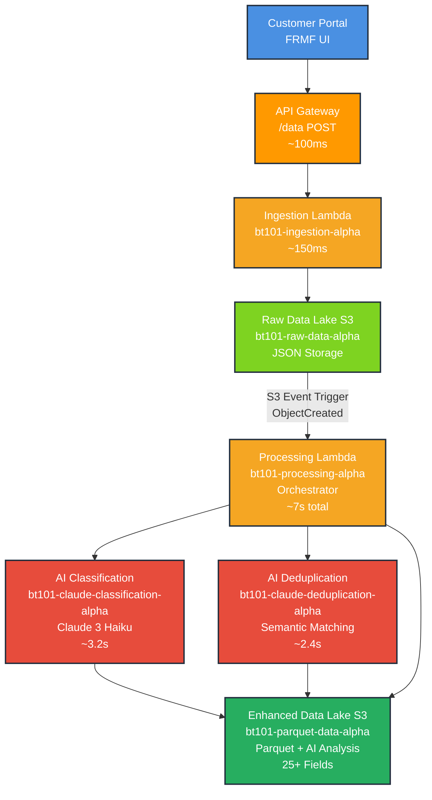

# FRMF Architecture Diagram (Mermaid)

Copy the code below and paste it into https://mermaid.live to generate the architecture diagram:

## Key Features:
- **AI-Powered Classification**: Category, priority, effort estimation, forecasting
- **Semantic Duplicate Detection**: 90% accuracy with confidence scoring
- **Complete Audit Trail**: Legal compliance and data governance
- **End-to-End Processing**: ~7 seconds from submission to enhanced data
- **Production Ready**: Serverless architecture with 5 Lambda functions

## Performance Metrics:
- **Portal Response**: ~200ms
- **Data Ingestion**: ~150ms  
- **AI Classification**: ~3.2s
- **Duplicate Detection**: ~2.4s
- **Total Pipeline**: ~7 seconds
- **Enhanced Fields**: 25+ AI-generated attributes per request